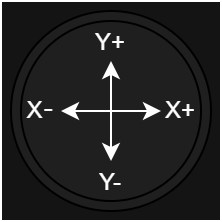

.. _JoystickPeripheral:

Joystick
========
| **Nintendo Switch Joysticks**
| **Texas Instruments TLA2024IRUGT Sigma-Delta ADC**

.. note::
    The joysticks are connected to an external ADC converter, which can be accessed using I2C

.. admonition:: Datasheets
    
    * `TLA2024IRUGT Datasheet </_static/datasheets/yggdrasil/TLA2024IRUGT.pdf>`_ 

Description
-----------

Both joysticks are connected to the TLA2024IRUGT ADC, which can be accessed using I2C. The buttons on the joysticks
can also be read as every other gpio. 
Theoretically each axis give a value from -100 to 100, but due to product tolerances, this values are not reached with every joystick.
To guarantee that 0|0 is read even the hands are on the joysticks, there is a default deadzone from 5.  

Coordinates
^^^^^^^^^^^

| The following image describes the coordinates returned by the joysticks when moving it around.
|

Usage
-----

This example shows how to read the deadzone, set a new one and access the joystick data.

.. tabs::

    .. code-tab:: c

        // Get the deadzone 
        u8 deadzone = yggdrasil_Joystick_GetDeadzone();

        // Double the deadzone
        yggdrasil_Joystick_SetDeadzone(2 * deadzone);

        // Get the left joystick data
        struct JoystickData data = yggdrasil_Joystick_GetLeft();
        printf("Left joystick X: %d, Y: %d, radius from center: %d, button: %d\n", 
            data.pos.x, data.pos.y, data.mag, data.pressed);

    .. code-tab:: cpp

        // Get the deadzone 
        auto deadzone = bsp::ygg::prph::Joystick::getDeadzone();

        // Double the deadzone
        bsp::ygg::prph::Joystick::setDeadzone(2 * deadzone);

        // Get the left joystick data
        auto data = bsp::ygg::prph::Joystick::getLeft();
        printf("Left joystick X: %d, Y: %d, radius from center: %d, button: %d\n", 
            data.pos.x, data.pos.y, data.mag, data.pressed);

