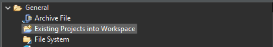

.. _asgard_m4_getting_started:

Coprocessor
===========

Setup
-----

To start developing on the Yggdrasil platform using Asgard's Coprocessor, the following things are needed:

.. seealso::
    * `STM32CubeIDE <https://www.st.com/en/development-tools/stm32cubeide.html>`_
    * `Asgard Template <https://gitlab.ti.bfh.ch/yggdrasil/asgard/asgard_coprocessor_template>`_

After starting the IDE for the first time, close the welcome screen and click on ``File -> Import...``.
Then import the Midgard Template using the ``Existing Project into Workspace`` option.

.. tabs::

    .. group-tab:: C

        For starting with embedded C development, simply open ``Core/main.c``, scroll down to find the ``main`` function and in there scroll further down until you find a block
        of code that looks like this:

        .. code-block:: c

            /* Infinite loop */
            /* USER CODE BEGIN WHILE */
            while (1)
            {
            /* USER CODE END WHILE */
        
            /* USER CODE BEGIN 3 */
            }
            /* USER CODE END 3 */

        All code goes between one of the ``/* USER CODE BEGIN XXX*/`` and ``/*USER CODE END XXX*/`` blocks. This is important since everything outside of these blocks
        will be deleted when the project is regenerated with the .ioc file.

    .. group-tab:: C++

        For starting with embedded C++ development, a few more things are needed.
        First, create a new file called e.g ``cpp_main.cpp`` in the ``Core/Src`` folder. In there, include ``<yggdrasil.h>`` and create a new function like this:

        .. code-block:: cpp

            #include <yggdrasil.h>

            C_LINKAGE void cpp_main() {

            }

        Then in ``main.c`` again, add a function prototype to the top of the file:

        .. code-block:: cpp

            void cpp_main(void);

        Now call this function above the infinite loop in ``main`` and add all your C++ code to the ``cpp_main`` function.

Testing
-------

Engineering mode
^^^^^^^^^^^^^^^^

It's possible to test Coprocessor applications by switching the controller into Engineering boot mode using the boot mode switches.
After that, it can be programmed similar to Midgard using the STM32CubeIDE.

.. note::
    In contrast to Midgard, the coprocessor firmware resides exclusively in RAM. This means resetting the core through the IDE will erase the program
    and it needs to be reflashed before testing again. 

Linux
^^^^^

To load the coprocessor firmware while Linux is running, the firmware's .elf file can be placed in ``/lib/firmware`` on Asgard's rootfs.

Afterwards the firmware can be loaded through sysfs using the following commands:

.. code-block:: shell

    $ cd /sys/class/remoteproc/remoteproc0
    $ echo "stop" > state
    $ echo "firmware.elf" > firmware
    $ echo "start" > state

This is mainly useful when using Asynchronous Multiprocessing or when releasing a final version of the product.

Troubleshooting
---------------

Peripherals don't work at all
^^^^^^^^^^^^^^^^^^^^^^^^^^^^^

Code generated by the CubeIDE often fails to properly enable clocks for some peripherals. This is due to it thinking Linux on the A7 core is enabling them which isn't running
in engineering boot mode. It's easy to see which clocks aren't enabled by checking the ``SFRs`` debug tab in the CubeIDE for peripheral registers it can't read.

OpenAMP crashes in engineering boot mode
^^^^^^^^^^^^^^^^^^^^^^^^^^^^^^^^^^^^^^^^

When using OpenAMP for Asynchronous Multiprocessing its initialization needs to be disabled in Engineering boot mode. Otherwise the M4 will run into a hardfault.