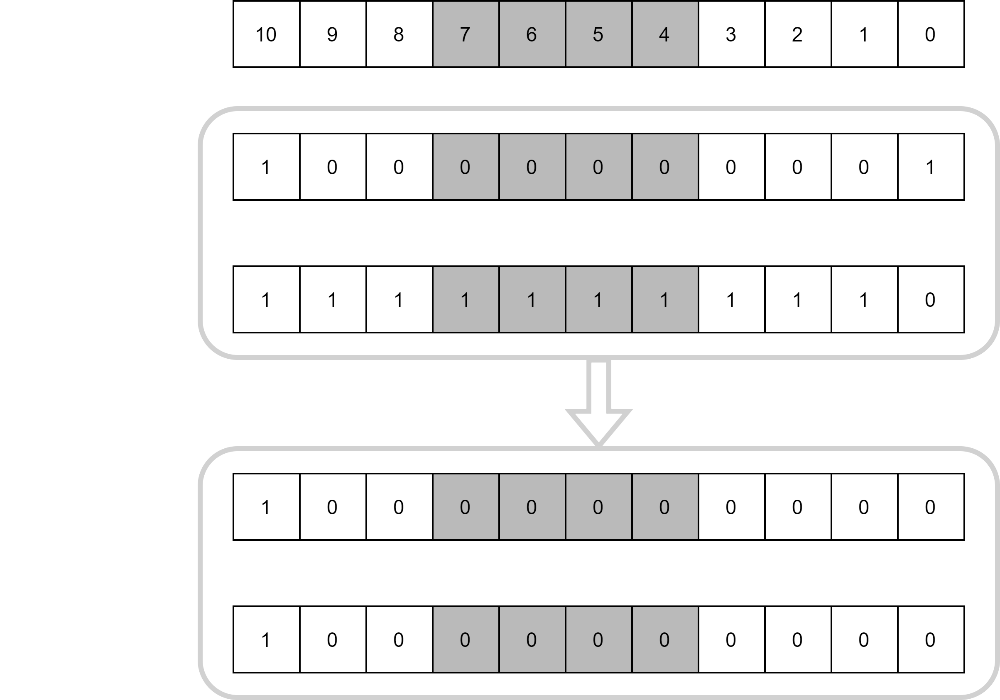
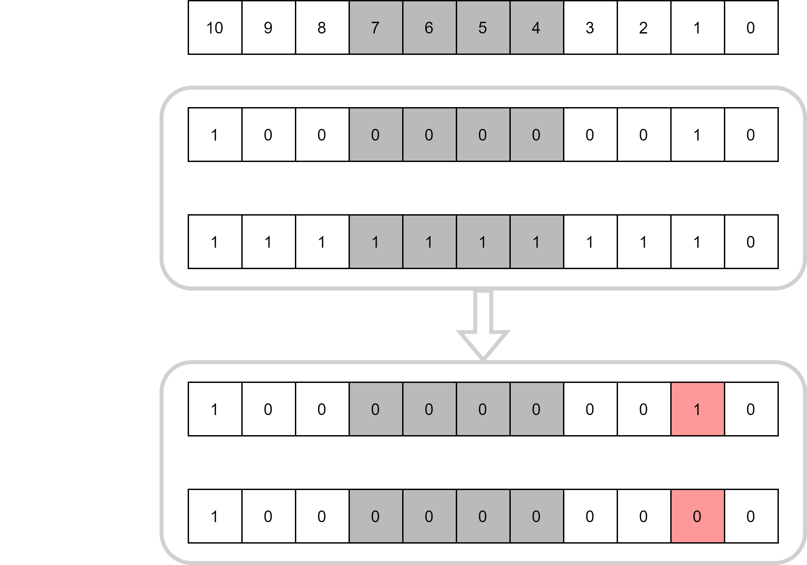

.. _CanInterface:

CAN Interface
=============

.. note::
    CAN (Controller Area Network) is a robust vehicle bus standard designed to allow microcontrollers and devices to communicate with each other's applications without a host computer. 

.. seealso::
    * `ISO1044BDR Datasheet </_static/datasheets/yggdrasil/iso1044bdr.pdf>`_ 
    * :ref:`CAN Connector <CanConnector>`

Simple Usage
------------

.. important::
    The CAN IC needs a external power supply (5V) due to the galvanic isolation. Otherwise there will be no signal.
    With the jumper, the termination resistance can be connected.

The CAN interface is initialized from the BSP with the filter bank 0 configured to accept all IDs.

The example below shows how to write to the CAN bus.

.. tabs::

    .. code-tab:: c

        // Send on standard ID
        u32 txdata = 0xAABBCCDD;
        yggdrasil_CAN_Write(CANA, 0x123, &txdata, sizeof(txdata));

        // Send on extended ID
        yggdrasil_CAN_Write(CANA, 0x12345, &txdata, sizeof(txdata));

    .. code-tab:: cpp

        // Send on standard ID
        bsp::CANA::write(0x123, 0xAABBCCDD);

        // Send on extended ID
        bsp::CANA::write(0x12345, 0xAABBCCDD);

The code below shows how to read 4 bytes from the bus. This function is polling.

.. tabs::

    .. code-tab:: c

        // Receive 4 bytes
        u32 rxdata;
        u32 id;
        yggdrasil_CAN_Read(CANA, &id,  &rxdata, sizeof(rxdata));

    .. code-tab:: cpp

        // Receive 4 bytes
        auto packet = bsp::CANA::read<std::array<u8, 4>>();

The following code will do a simple echo for a message of 4 bytes. 

.. tabs::

    .. code-tab:: c

        // Simple echo
        u32 data;
        u32 id = 0;
        yggdrasil_CAN_Read(CANA, &id,  &data, sizeof(data));
        yggdrasil_CAN_Write(CANA, id, &data, sizeof(data));

    .. code-tab:: cpp

        // Simple echo
        bsp::CANA::write(bsp::CANA::read<std::array<u8, 4>>());

Available Pins
--------------

+-------+-----------------------------+
| Name  | Description                 |
+=======+=============================+
| CANA  | CAN screw terminal A        |
+-------+-----------------------------+
| CANB  | CAN screw terminal B        |
+-------+-----------------------------+

Filter Banks
------------

The CAN hardware usually got different filter banks, which allow the user to configure multiple filter. For Example, STM32 CAN hardware got 28 filter banks. 

To configure a filter bank, the filter ID, the mask and the bank number are needed. 

    * Bank : Filter bank number
    * Filter ID :  Filter ID will be matched with the masked ID
    * Mask : Filter mask, defines which bits of the ID are masked

The following example shows how the filter works. The filter is configured with the ID 0x400 and the mask 0x7FE. 
The CAN hardware module receive a packet with the the ID 0x401. The received ID is bitwise anded with the mask which results in a masked ID 0x400. 
If the masked ID equals the filter ID, then the CAN hardware proceeds with the package.  

A filter configured with a filter ID of 0x400 and a mask of 0x7FE will only accept ID 0x400 and ID 0x401.

Here is the same example with another incoming ID. In this case the ID is 0x402 which will not be accepted, since the masked ID is not equal to the filter ID. 

.. note::

    There are also filter configurations which will never accept a packet. For example the mask from above (0x7FE) and the filter ID 0x401. BIT 0 in the masked ID can never be 1 with this mask. 
    Don not forget that xou have multiple filter banks before you try to configure the filter. The easiest way to use the filter is to just accept one ID. Below is an example code.

Code example to accept ID 0x400 and 0x401

.. tabs::

    .. code-tab:: c

        // Set the filter bank 0 to accept ID 0x400 and 0x401 
        yggdrasil_CAN_SetStdFilter(CANA, 0, 0x400, 0x7FE);

    .. code-tab:: cpp

        // Set the filter bank 0 to accept ID 0x400 and 0x401 
        bsp::CANA::setStdFilter(0, 0x400, 0x7FE);

The simplest way to accept multiple IDs, is to use different filter banks and just accept one ID per bank. 

.. tabs::

    .. code-tab:: c

        // Set the filter bank 0 to accept ID 0x100
        yggdrasil_CAN_SetStdFilter(CANA, 0, 0x100, 0x7FF);

        // Set the filter bank 1 to accept ID 0x105
        yggdrasil_CAN_SetStdFilter(CANA, 1, 0x105, 0x7FF);

    .. code-tab:: cpp

        // The mask will automatically be set to 0x7FF and can be left out.
        // Set the filter bank 0 to accept ID 0x100
        bsp::CANA::setStdFilter(0, 0x100);

        // Set the filter bank 1 to accept ID 0x105
        bsp::CANA::setStdFilter(1, 0x105);

Custom CAN
-----------

.. note::

    For a custom CAN interface a external FD CAN Transceiver is needed.

In order to use a FD CAN that has not been pre-defined by libyggdrasil, first it needs to be properly configured through the project's .ioc file. 
Once this is done, the new CAN can be defined like this:

.. tabs::

    .. code-tab:: c

        const static can_t MyCAN = { &hcan1 };

    .. code-tab:: cpp

        using MyCAN = bsp::drv::CAN<&hcan1, bsp::mid::drv::CAN>;

and then used like all the other CAN.

