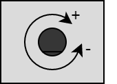

.. _EncoderPeripheral:

Encoder
=======

.. seealso::
    * :ref:`Timer interface <TimerInterface>`

Description
-----------

With the timer F (TIM8) in the encoder mode, the onboard encoder can be used. 

Measurement values
^^^^^^^^^^^^^^^^^^

| The following diagram shows what turn direction of the encoder leads to a increase or decrease of the internal counter.
|

Usage
-----

The encoder mode will be enabled through the bsp. In the example below, the functions to get the encoder data are explained. 

.. code-block:: cpp

    // Get the direction of the ongoing or the last rotation
    auto direction = bsp::Encoder.getDirection();

    // Get the count 
    auto count = bsp::Encoder.getCount();

    // Set the count to a desired value
    bsp::Encoder.setCount(1000);

    // Get the encoder button state 
    auto buttonState = bsp::EncoderButton;
