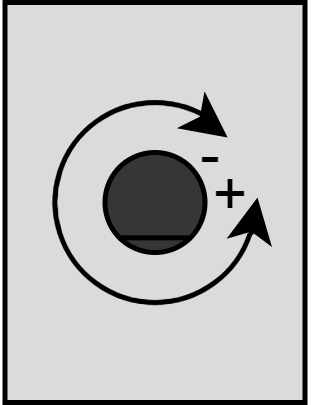

.. _PotentiometerPeripheral:

Potentiometer
=============

.. seealso::
    * :ref:`ADC interface <AdcInterface>`

Description
-----------

The potentiometer is connected to the internal ADC 2 channel 13. 

Measurement values
^^^^^^^^^^^^^^^^^^

| The following diagram shows what turn direction of the potentiometer leads to a increase or decrease of voltage at the ADC.
|

Usage
-----

Using the read only ADCPotentiometer the value can be read. The functions delivers the value transformed to an interval between 0 and 1. 

.. tabs::

    .. code-tab:: c

        // Read the potentiometer value
        float adcValue = yggdrasil_ADC_Read(ADCPotentiometer);

    .. code-tab:: cpp

        // Read the potentiometer value
        auto adcValue = bsp::ADCPotentiometer;

This value can be multiplied with the reference voltage (3.3V) or for example with 100 to get the rotation in %.