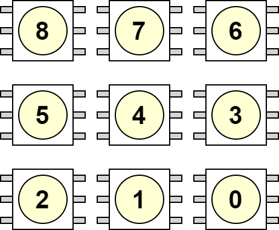

.. _RgbMatrixPeripheral:

RGB LED Matrix
==============
**SK9822 RGB LED**

.. admonition:: Datasheets
    
    * `SK9822 Datasheet </_static/datasheets/yggdrasil/SK9822.pdf>`_ 

Description
-----------

The 3 x 3 LED matrix uses SK9822 leds. These are also known as a clone from the APA102C RGB leds.
These leds have 4 built in pwm generators. For the red, green and blue channel three times a 8 bit pwm and for the global brightness a 5 bit pwm.

.. warning::
    Each led consumes up to 200mW. It is not recommended to look at the leds directly.

Indices
^^^^^^^

| Each LED has an index that is used when setting individul LED colors.
|

Usage
-----

.. note::

    When enabling the LEDs, SPIA wil be set to mode 3

Example to set LED 1 and 7 

.. tabs::

    .. code-tab:: c 

        RGBA8 color = { 0x08, 0, 0, 0x04 };

        // Enable the leds
        yggdrasil_RGBMatrix_Enable();

        // Set led 1 and 7
        yggdrasil_RGBMatrix_SetLed(1, color);
        yggdrasil_RGBMatrix_SetLed(7, color);

        // Send the data to the leds
        yggdrasil_RGBMatrix_Flush();

    .. code-tab:: cpp 

        bsp::ygg::RGBA8 color = { 0x08, 0, 0, 0x04 };

        // Enable the leds
        bsp::ygg::prph::RGBMatrix::enable();

        // Set led 1 and 7
        bsp::ygg::prph::RGBMatrix::setLed(1, color);
        bsp::ygg::prph::RGBMatrix::setLed(7, color);

        // Send the data to the leds
        bsp::ygg::prph::RGBMatrix::flush();

Example to set all LEDs at one. In this case LED 0, 2, 4, 6 and 8 will be set

.. tabs::

    .. code-tab:: c 

        RGBA8 color = { 0x08, 0, 0, 0x04 };

        // Enable the leds
        yggdrasil_RGBMatrix_Enable();

        // Set led 0, 2, 4, 6 and 8
        yggdrasil_RGBMatrix_SetLedMasked(0b101'010'101, color);

        // Send the data to the leds
        yggdrasil_RGBMatrix_Flush();

    .. code-tab:: cpp 

        bsp::ygg::RGBA8 color = { 0x08, 0, 0, 0x04 };

        // Enable the leds
        bsp::ygg::prph::RGBMatrix::enable();

        // Set led 0, 2, 4, 6 and 8
        bsp::ygg::prph::RGBMatrix::setLedMasked(0b101'010'101, color);

        // Send the data to the leds
        bsp::ygg::prph::RGBMatrix::flush();

Example to use the dice function, which will display the number as a dice would show it.

.. tabs::

    .. code-tab:: c 

        RGBA8 color = { 0x08, 0, 0, 0x04 };

        // Enable the leds
        yggdrasil_RGBMatrix_Enable();

        // Display number 6
        yggdrasil_RGBMatrix_Dice(6, color);

        // Send the data to the leds
        yggdrasil_RGBMatrix_Flush();

    .. code-tab:: cpp 

        bsp::ygg::RGBA8 color = { 0x08, 0, 0, 0x04 };

        // Enable the leds
        bsp::ygg::prph::RGBMatrix::enable();

        // Display number 6
        bsp::ygg::prph::RGBMatrix::dice(6, color);

        // Send the data to the leds
        bsp::ygg::prph::RGBMatrix::flush();

Example to show all possible colors

.. tabs::

    .. code-tab:: c 

        RGBA8 color = { 0, 0, 0, 0x01 };
        float cnt = 0;
        yggdrasil_RGBMatrix_Enable();

        while(1) {

            // Calculate the color value from 0 to 255 with a 120° phase shift
            color.r = (u8)(((sin(cnt) + 1) * 255) / 2.0F);
            color.g = (u8)(((sin(cnt + 2/3.0F * M_PI) + 1) * 255) / 2.0F);
            color.b = (u8)(((sin(cnt + 4/3.0F * M_PI) + 1) * 255) / 2.0F);

            yggdrasil_RGBMatrix_SetLedMasked(0b111'111'111, color);
            yggdrasil_RGBMatrix_Flush();

            cnt += 0.01;
            core_Delay(10);
        }

    .. code-tab:: cpp 

        bsp::ygg::RGBA8 color = {0, 0, 0, 0x01};
        float cnt = 0;
        bsp::ygg::prph::RGBMatrix::enable();

        while(true) {

            // Calculate the color value from 0 to 255 with a 120° phase shift
            color.r = static_cast<u8>(((std::sin(cnt) + 1) * 255) / 2.0F);
            color.g = static_cast<u8>(((std::sin(cnt + 2/3.0F * bsp::math::Pi<float>) + 1) * 255) / 2.0F);
            color.b = static_cast<u8>(((std::sin(cnt + 4/3.0F * bsp::math::Pi<float>) + 1) * 255) / 2.0F);

            bsp::ygg::prph::RGBMatrix::setLedMasked(0b111'111'111, color);
            bsp::ygg::prph::RGBMatrix::flush();

            cnt += 0.01;
            bsp::core::delay(10);
        }