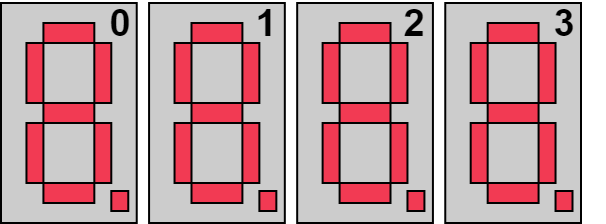
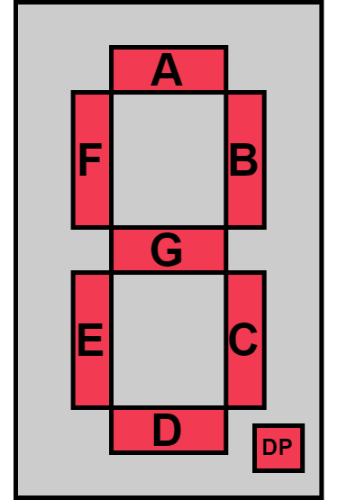

.. _SevenSegmentPeripheral:

7-Segment Display
=================
**BROADCOM HDSP-A103 common cathode 7-Segment digit**

.. admonition:: Datasheets
    
    * `HDSP-A103 Datasheet </_static/datasheets/yggdrasil/HDSP-A103.pdf>`_ 

Indices
^^^^^^^

| When interacting with individual 7-Segments, the following indexing is used. 
|

|
| If instead individual segments should get addressed, the typical naming convention is used.
| 

Description
-----------

The four 7-segment displays can be used in four different modes;

* Display a unsigned integer from 0 to 9999
* Display a signed integer from -999 to 999
* Display an unsigned integer in hexadecimal
* Display a floating point value from -99.9 to 99.9

The floating point representation changed the decimal point according to the value. If the value is in the rang ]-10 to 10[ there will be two decimal points.

.. note::
    When using a function to display a value, the function must be called frequently (>200Hz), since the function takes care of the multiplexing.

Usage
-----

.. note:: 
    When the function is called in a while loop with no delay, the multiplexing will have some errors due to switching delays. 

To shut down, the disable function can be used. This function will disable all segments and digits.

Example to display an unsigned integer

.. tabs::

    .. code-tab:: c

        while(1) {

            // Set the value
            yggdrasil_SevenSegment_SetUnsigned(1234);

            // Add a delay
            core_Delay(1);

        }

    .. code-tab:: cpp

        while(true) {

            // Set the value
            bsp::ygg::prph::SevenSegment::setUnsigned(1234);

            // Add a delay
            bsp::core::delay(1);

        }
    
Example to display an unsigned integer in hexadecimal

.. tabs::

    .. code-tab:: c

        while(1) {

            // Set the value
            yggdrasil_SevenSegment_SetHexadecimal(0xACDC);

            // Add a delay
            core_Delay(1);

        }

    .. code-tab:: cpp

        while(true) {

            // Set the value
            bsp::ygg::prph::SevenSegment::setHexadecimal(0xACDC);

            // Add a delay
            bsp::core::delay(1);

        }

Example to display an signed integer

.. tabs::

    .. code-tab:: c

        while(1) {

            // Set the value
            yggdrasil_SevenSegment_SetSigned(-123);

            // Add a delay
            core_Delay(1);

        }

    .. code-tab:: cpp

        while(true) {

            // Set the value
            bsp::ygg::prph::SevenSegment::setSigned(-123);

            // Add a delay
            bsp::core::delay(1);

        }

Example to display an floating point value

.. tabs::

    .. code-tab:: c

        while(1) {

            // Set the value
            yggdrasil_SevenSegment_SetFloatingPoint(-3.14);

            // Add a delay
            core_Delay(1);

        }

    .. code-tab:: cpp

        while(true) {

            // Set the value
            bsp::ygg::prph::SevenSegment::setFloatingPoint(-3.14);

            // Add a delay
            bsp::core::delay(1);

        }

It is also possible to access the every digit on it own.
The example below will print 6 to the second digit from the left.

.. tabs::

    .. code-tab:: c

        while(1) {

            // The value to display (accepts also hexadecimal)
            yggdrasil_SevenSegment_SetDigit(6);

            // Enable the digit. in this case the second from the left
            yggdrasil_SevenSegment_EnableDigit(1);

            // The delay is optional, since no multiplexing is done
            core_Delay(1);

        }

    .. code-tab:: cpp

        while(true) {

            // The value to display (accepts also hexadecimal)
            bsp::ygg::prph::SevenSegment::setDigit(6);

            // Enable the digit. in this case the second from the left
            bsp::ygg::prph::SevenSegment::enableDigit(1);

            // The delay is optional, since no multiplexing is done
            bsp::core::delay(1);

        }
