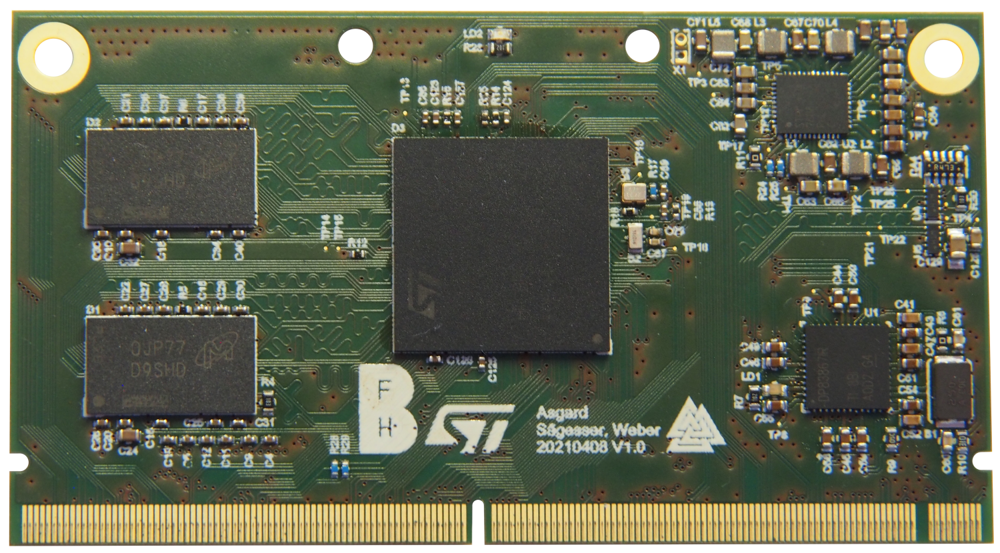

.. _AsgardBoard:

Asgard
======

.. admonition:: Datasheets

    * `MPU STM32MP157C Datasheet </_static/datasheets/asgard/STM32MP157C/datasheet.pdf>`_ 
    * `MPU STM32MP157C Reference manual </_static/datasheets/asgard/STM32MP157C/reference_manual.pdf>`_ 
    * `MPU Arm Cortex M4 Reference manual </_static/datasheets/asgard/STM32MP157C/coreM4_reference_manual.pdf>`_ 
    * `MPU Arm Cortex A7 Reference manual </_static/datasheets/asgard/STM32MP157C/coreA7_reference_manual.pdf>`_ 
    * `PMIC STPMIC1 Datasheet </_static/datasheets/asgard/STPMIC1/datasheet.pdf>`_ 
    * `Ethernet Phy DP83867 Datasheet </_static/datasheets/asgard/DP83867/datasheet.pdf>`_ 
    * `DDR3L SDRAM MT41K256M16TW Datasheet </_static/datasheets/asgard/DDR3LSDRAM/datasheet.pdf>`_ 

Asgard is a powerful SBC with a dual core ARM Cortex A7 + Cortex M4 STM32MP1 SoC, 1GB of DDR3 RAM and Gigabit Ethernet support. It's capable of running Linux and Android
as well as code with real-time requirements on it's coprocessor.

Peripherals
-----------

MPU STM32MP157C
^^^^^^^^^^^^^^^

Core
""""
* 32-bit dual-core Arm® Cortex®-A7
    * L1 32-Kbyte I / 32-Kbyte D for each core
    * 256-Kbyte unified level 2 cache
    * Arm® NEON™ and Arm® TrustZone®
* 32-bit Arm® Cortex®-M4 with FPU/MPU
    * Up to 209 MHz (Up to 703 CoreMark®)

Memories
""""""""
* External DDR memory of 1 Gbyte DDR3/DDR3L-1066 16/32-bit
* 708 Kbytes of internal SRAM: 256 Kbytes of AXI SYSRAM + 384 Kbytes of AHB SRAM + 64 Kbytes of AHB SRAM in Backup domain and 4 Kbytes of SRAM in Backup domain
* Dual mode Quad-SPI memory interface
* Flexible external memory controller with up to 16-bit data bus: parallel interface to connect external ICs and SLC NAND memories with up to 8-bit ECC

Security/safety
"""""""""""""""
* Secure boot, TrustZone® peripherals, active tamper
* Cortex®-M4 resources isolation

Graphics
""""""""
* 3D GPU: Vivante® - OpenGL® ES 2.0
    * Up to 26 Mtriangle/s, 133 Mpixel/s
* LCD-TFT controller, up to 24-bit // RGB888
    * up to WXGA (1366 × 768) @60 fps or up to Full HD (1920 × 1080) @30 fps
    * Pixel clock up to 90 MHz
    * Two layers with programmable colour LUT
* MIPI® DSI 2 data lanes up to 1 GHz each

General-purpose input/outputs
"""""""""""""""""""""""""""""
* 176 I/O ports with interrupt capability
* Up to 8 secure I/Os
* Up to 6 Wakeup, 3 tampers, 1 active tamper

PMIC STPMIC1A
^^^^^^^^^^^^^
Highly integrated power management IC for micro processor units

* Input voltage range from 2.8 V to 5.5 V
* 4 adjustable general purpose LDOs
* 4 adjustable adaptive constant on-time (COT) buck SMPS converters
* 5.2 V / 1.1 A boost SMPS with bypass mode for 5 V input or battery input
* I²C and digital IO control interface

Ethernet Phy DP83867IR
^^^^^^^^^^^^^^^^^^^^^^
Robust, High Immunity 10/100/1000 Ethernet Physical Layer Transceiver

* Ultra low RGMII latency TX < 90ns, RX < 290ns
* Low power consumption 457 mW
* 16 programmable RGMII delay modes on RX/TX
* Programmable MII/GMII/RGMII termination impedance
* WoL (Wake-on-LAN) packet detection
* Fully compatible to IEEE 802.3 10BASE-Te, 100BASE-TX, and 1000BASE-T Specification

DDR3L SDRAM MT41K256M16TW
^^^^^^^^^^^^^^^^^^^^^^^^^
DDR3L SDRAM (1.35V) is a low voltage version of the DDR3 (1.5V) SDRAM. Refer to DDR3 (1.5V) SDRAM (Die Rev :E) data sheet specifications when running in 1.5V compatible mode.

* Differential bidirectional data strobe
* 8n-bit prefetch architecture
* Differential clock inputs (CK, CK#)
* 8 internal banks
* Nominal and dynamic on-die termination (ODT) for data, strobe, and mask signals
* Programmable CAS (READ) latency (CL)
* Programmable posted CAS additive latency (AL)
* Programmable CAS (WRITE) latency (CWL)
* Fixed burst length (BL) of 8 and burst chop (BC) of 4 (via the mode register set [MRS])
* Selectable BC4 or BL8 on-the-fly (OTF)
* Self refresh mode

.. toctree::
   :maxdepth: 1
   :caption: Contents:
   :hidden:

   pcb
   u-boot/u-boot
   linux/linux
   android/android