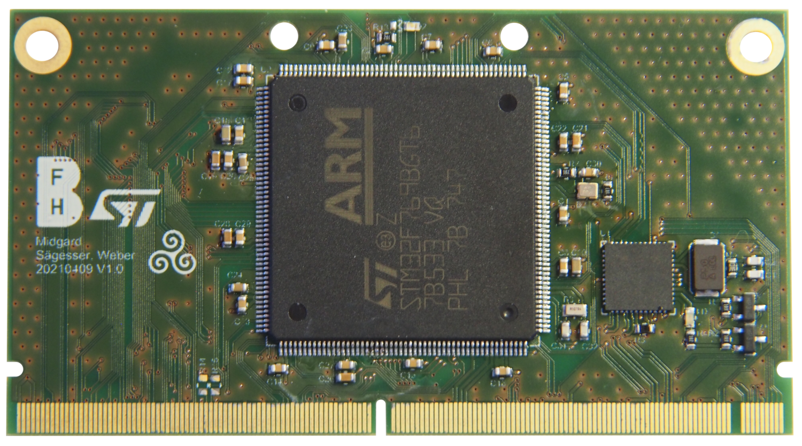

.. _MidgardBoard:

Midgard
=======

.. admonition:: Datasheets

    * `MCU STM32F769 Datasheet </_static/datasheets/midgard/STM32F769/datasheet.pdf>`_ 
    * `MCU STM32F769 Reference manual </_static/datasheets/midgard/STM32F769/reference_manual.pdf>`_ 
    * `MCU Arm Cortex M7 Reference manual </_static/datasheets/midgard/STM32F769/core_reference_manual.pdf>`_ 
    * `Ethernet Phy DP83620 Datasheet </_static/datasheets/midgard/DP83620/datasheet.pdf>`_ 

Midgard is a powerful but easy to use development board with a STM32F7 microcontroller as well as 100 Mbit eithernet support.

Peripherals
-----------

MCU STM32F769BGT6
^^^^^^^^^^^^^^^^^

Core
""""
Arm® 32-bit Cortex®-M7 CPU with DPFPU, ART Accelerator and L1-cache, execution from embedded Flash and external memories, up to 216 MHz, 462 DMIPS/2.14 DMIPS/MHz (Dhrystone 2.1), and DSP instructions.

Memory
""""""
* 1 Mbyte of Flash memory organized into two banks allowing read-while-write
* SRAM: 512 Kbytes (including 128 Kbytes of data TCM RAM for critical real-time data) + 16 Kbytes of instruction TCM RAM (for critical real-time routines) + 4 Kbytes of backup SRAM
* Flexible external memory controller with up to 32-bit data bus: SRAM, PSRAM, SDRAM/LPSDR SDRAM, NOR/NAND memories

Graphics
""""""""
* Chrom-ART Accelerator (DMA2D), graphical hardware accelerator enabling enhanced graphical user interface
* Hardware JPEG codec
* LCD-TFT controller supporting up to XGA resolution
* MIPI® DSI host controller supporting up to 720p 30 Hz resolution

Low-power
"""""""""
* Sleep, Stop and Standby modes
* VBAT supply for RTC, 32×32 bit backup registers + 4 Kbytes backup SRAM

Interfaces
""""""""""
* 3×12-bit, 2.4 MSPS ADC: up to 24 channels
* Digital filters for sigma delta modulator (DFSDM), 8 channels / 4 filters
* 2×12-bit D/A converters
* Dual mode Quad-SP
* General-purpose DMA: 16-stream DMA controller with FIFOs and burst support
* Up to 18 timers: up to thirteen 16-bit (1x lowpower 16-bit timer available in Stop mode) andtwo 32-bit timers, each with up to 4 IC/OC/PWM or pulse counter and quadrature (incremental) encoder input. All 15 timers running up to 216 MHz. 2x watchdogs, SysTick timer

Debug mode
""""""""""
* SWD and JTAG interfaces
* Cortex®-M7 Trace Macrocell™

GPIO Interrupts
"""""""""""""""
Up to 168 I/O ports with interrupt capability
* Up to 164 fast I/Os up to 108 MHz
* Up to 166 5 V-tolerant I/Os

Ethernet Phy DP83620
^^^^^^^^^^^^^^^^^^^^
Single Port 10/100 Mbps Ethernet Physical Layer Transceiver with Fiber Support

* Deterministic, Low Transmit and Receive Latency
* Selectable Frequency Synchronized Clock Output
* Dynamic Link Quality Monitoring
* TDR Based Cable Diagnostic and Cable Length Detection
* 10/100 Mb/s Packet BIST (Built in Self Test)
* Error-Free Operation up to 150 Meters CAT5 Cable
* ESD Protection - 8 kV Human Body Model
* 2.5 V and 3.3 V I/Os and MAC Interface
* Auto-MDIX for 10/100 Mbps
* Auto-Crossover in Forced Modes of Operation

* RMII Rev. 1.2 and MII MAC Interface
* RMII Master Mode
* Synchronous Ethernet Output
* 25 MHz MDC and MDIO Serial Management
* Programmable LED Support for Link, 10 /100 Mb/s Mode, Duplex, Activity, and Collision Detect
* Optional 100BASE-TX Fast Link Loss Detection

.. toctree::
   :maxdepth: 1
   :caption: Contents:
   :hidden:

   pcb