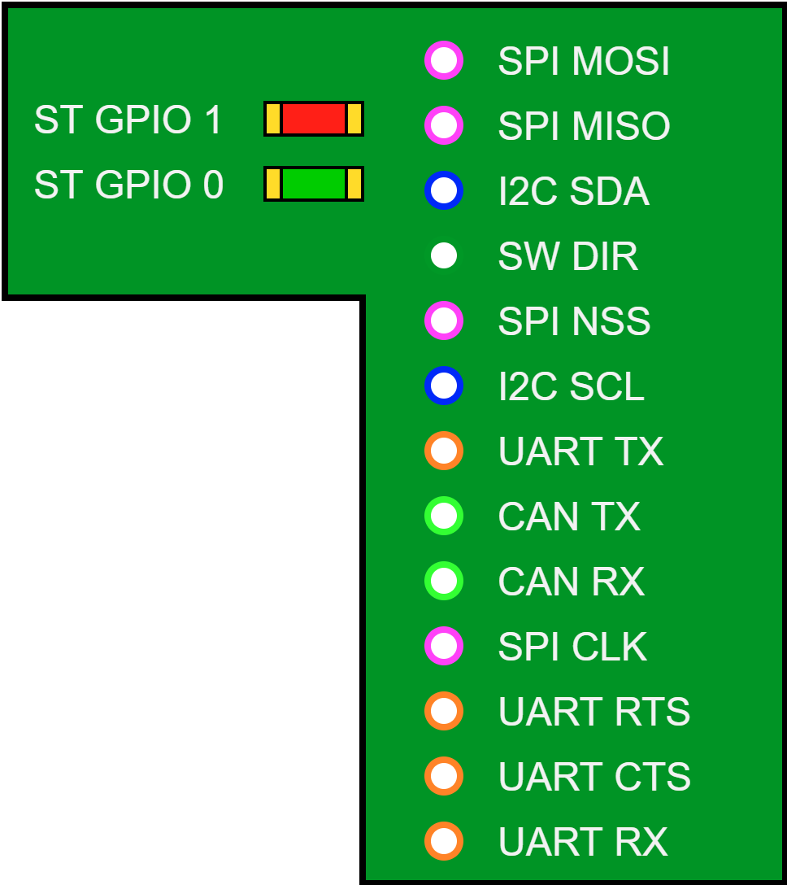

.. _StLinkBridgeConnector:

ST-Link Bridge Interface
========================

The ST-Link v3 on Yggdrasil allows talking to various interfaces through it's bridge interface. These pins have been exposed to THT Pads and two LEDs.

.. note::
    The easiest way to use the bridge interface is through `ST's C++ API <https://www.st.com/en/development-tools/stlink-v3-bridge.html>`_ or with the unofficial `Python API <https://github.com/dragonlock2/stbridge>`_

Connector
---------

