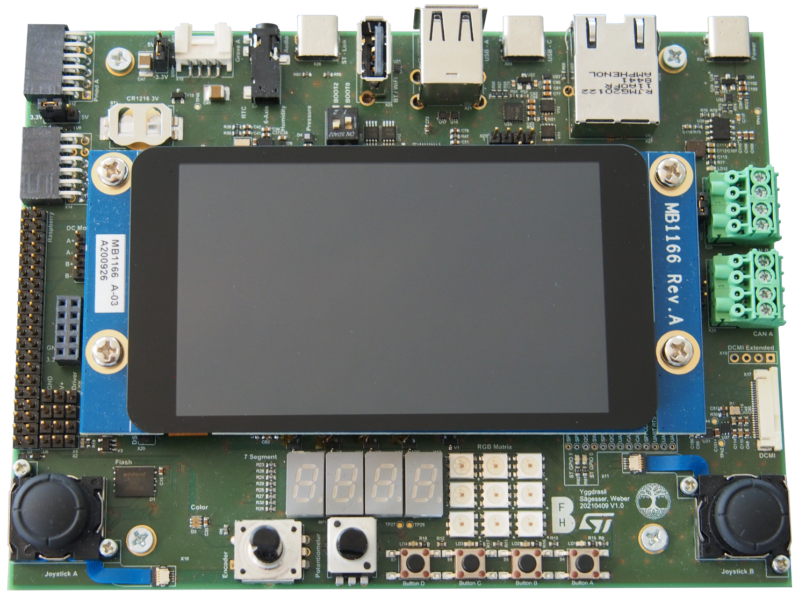

Yggdrasil
=========

Overview
--------

Yggdrasil is the main peripheral board of the Yggdrasil Platform. On it lots of connectors, sensor, actors and input devices can be found which can easily be interacted with from any World Board using libyggdrasil.

.. seealso::
    | **Boot Mode Configuration**
    | Explaination of the different boot modes
    | :ref:`>>> <boot_modes>`
.. seealso::
    | **On-Board Connectors**
    | Connecting external peripherals to Yggdrasil
    | :ref:`>>> <connectors>`

Map
---

This is a simple map of all peripherals found on Yggdrasil.

.. hint::
    Hover over peripherals to find out what they are or click on them to jump to the relevant documentation page

.. raw:: html

       
    <map name="yggdrasilmap">
        <area alt="Joystick Left"     title="Joystick Left"       coords="16,1061,156,1200"       shape="rect"    href="../libyggdrasil/peripherals/joystick.html">
        <area alt="Joystick Right"    title="Joystick Right"      coords="1446,1060,1588,1203"    shape="rect"    href="../libyggdrasil/peripherals/joystick.html">
        <area alt="Color Sensor"      title="Color Sensor"        coords="332,1089,391,1155"      shape="rect"    href="../libyggdrasil/peripherals/colorSensor.html">
        <area alt="7 Segment Display" title="7 Segment Display"   coords="516,986,821,1101"       shape="rect"    href="../libyggdrasil/peripherals/sevenSegment.html">
        <area alt="RGB LED Matrix"    title="RGB LED Matrix"      coords="832,983,985,1139"       shape="rect"    href="../libyggdrasil/peripherals/rgbMatrix.html">
        <area alt="Encoder"           title="Encoder"             coords="431,1109,559,1211"      shape="rect"    href="../libyggdrasil/peripherals/encoder.html">
        <area alt="Potentiometer"     title="Potentiometer"       coords="602,1108,688,1213"      shape="rect"    href="../libyggdrasil/interfaces/adc.html">
        <area alt="User LEDs"         title="User LEDs"           coords="757,1143,1050,1169"     shape="rect"    href="../libyggdrasil/interfaces/gpio.html">
        <area alt="User Buttons"      title="User Buttons"        coords="759,1171,1056,1214"     shape="rect"    href="../libyggdrasil/interfaces/gpio.html">
        <area alt="RTC"               title="RTC"                 coords="361,224,442,276"        shape="rect"    href="../libyggdrasil/peripherals/rtc.html">
        <area alt="6-Axis sensor"     title="6-Axis sensor"       coords="466,208,535,276"        shape="rect"    href="../libyggdrasil/peripherals/sixAxisSensor.html">
        <area alt="Humidity sensor"   title="Humidity sensor"     coords="547,209,603,273"        shape="rect"    href="../libyggdrasil/peripherals/humiditySensor.html">
        <area alt="Pressure sensor"   title="Pressure sensor"     coords="616,211,680,273"        shape="rect"    href="../libyggdrasil/peripherals/pressureSensor.html">
        <area alt="CAN"               title="CAN"                 coords="1453,341,1582,630"      shape="rect"    href="connectors/can.html">
        <area alt="DCMI"              title="DCMI"                coords="1487,792,1596,1002"     shape="rect">
        <area alt="STLINK-V3 bridge"    title="STLINK-V3 bridge"      coords="1138,985,1408,959"      shape="rect"    href="connectors/stlinkBridge.html">
        <area alt="Display"           title="Display"             coords="185,320,1424,949"       shape="rect"    href="../libyggdrasil/interfaces/display.html">
        <area alt="Grove"             title="Grove"               coords="223,20,364,117"         shape="rect"    href="connectors/grove.html">
        <area alt="PMod"              title="PMod"                coords="67,317,-1,18"           shape="rect"    href="connectors/pmod.html">
        <area alt="Flash/MRAM"        title="Flash/MRAM"          coords="182,1009,286,1089"      shape="rect">
        <area alt="Raspberry Pi "     title="Raspberry Pi"        coords="50,345,1,1005"          shape="rect"    href="connectors/raspberry.html">
        <area alt="Sink Drivers"      title="Sink Drivers"        coords="54,856,155,1007"        shape="rect"    href="connectors/driver.html">
        <area alt="Analog Headers"    title="Analog Headers"      coords="83,673,152,832"         shape="rect"    href="connectors/analog.html">
        <area alt="DC Motor header"   title="DC Motor header"     coords="115,492,152,631"        shape="rect"    href="../libyggdrasil/peripherals/motorDriver.html">
        <area alt="Boot modes"        title="Boot modes"          coords="721,188,817,283"        shape="rect"    href="bootModes.html">
        <area alt="5V USB C Power"    title="5V USB C Power"      coords="1477,96,1580,3"         shape="rect">
        <area alt="Ethernet"          title="Ethernet"            coords="1206,20,1412,273"       shape="rect">
        <area alt="USB C Data"        title="USB C Data"          coords="1036,95,1143,1"         shape="rect">
        <area alt="USB A Hub"         title="USB A Hub"           coords="820,11,970,195"         shape="rect">
        <area alt="WiFi / BT Dongle"  title="WiFi / BT Dongle"    coords="706,23,779,181"         shape="rect">
        <area alt="ST-Link Debug USB" title="ST-Link Debug USB"   coords="568,98,668,3"           shape="rect">
        <area alt="Headphone Jack"    title="Headphone Jack"      coords="448,16,511,166"         shape="rect">
        <area alt="CR1216 RTC Battery"title="CR1216 RTC Battery"  coords="131,194,302,284"        shape="rect">
    </map>

    
    

Peripherals
-----------

Here is a full list of all features Yggdrasil has.

Connectors
^^^^^^^^^^

* 2 x **Digilent PMod Interface, Configurable between 3.3V and 5V**
* 2 x **Seeed Grove Interface, Configurable between 3.3V and 5V**
* 1 x **2.4mm Headphone Jack**
* 1 x **USB-C for data transfer**
* 4 x **USB-A with one dedicated WiFi / Bluetooth dongle port**
* 1 x **USB-C STLINK-V3 Debug connector**
* 1 x **Gigabit Ethernet**
* 1 x **USB-C 5V/3A Power connector**
* 2 x **CAN screw terminals**
* 1 x **8bit DCMI flex connector with additional 4bit header for a total of 12bit DCMI**
* 2 x **MIPI-DSI connectors**
* 1 x **Raspberry Pi Shield Connector**
* 4 x **5A Sink driver**
* 1 x **Analog Header with 4 ADCs and 2 DACs**
* 1 x **DC Motor connector**
* 1 x **Reset and Subnet Reset header**
* 1 x **CR1216 Battery clip**
* 1 x **Micro SD-Card slot**
* 1 x **SODIMM314 Card slot for World Boards, Compatible with the Toradex Apalis series**
* 1 x **STLINK-V3 Bridge Interface, Support for GPIOs, I2C, SPI, UART and FD-CAN**
* 1 x **SWD Debug Port**

Sensors
^^^^^^^

* 1 x **Color Sensor with 16 bit per color and illumination LEDs**
* 1 x **Real Time Clock with UNIX time support**
* 1 x **6-Axis Sensor with Accelerometer, Gyroscope and Thermometer**
* 1 x **Air Humidity Sensor with Thermometer**
* 1 x **Atmospheric Pressure Sensor with Thermometer**

Input / Output devices
^^^^^^^^^^^^^^^^^^^^^^

* 4 x **User Buttons**
* 8 x **User LEDs, 4 User LEDs connected to Sink drivers**
* 9 x **Serial RGB LEDs**
* 4 x **Seven-Segment Display**
* 1 x **800x480 True Color Touch LCD Display**
* 1 x **Potentiometer**
* 1 x **Incremental Encoder with up to 96 steps**
* 2 x **Joystick with 4-Channel 12bit Sigma-Delta ADC**
* 1 x **Audio Codec with microphone and Stereo Speakers**
* 1 x **1Gb Serial NAND Flash or 8Mb Serial MRAM**
* 1 x **Dual DIP Switch for Boot Mode configuration**

.. toctree::
   :maxdepth: 1
   :caption: Contents:
   :hidden:

   pcb
   bootModes
   connectors/connectors
